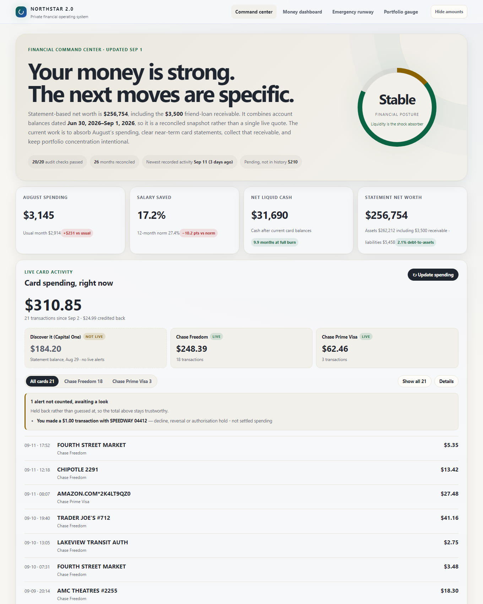
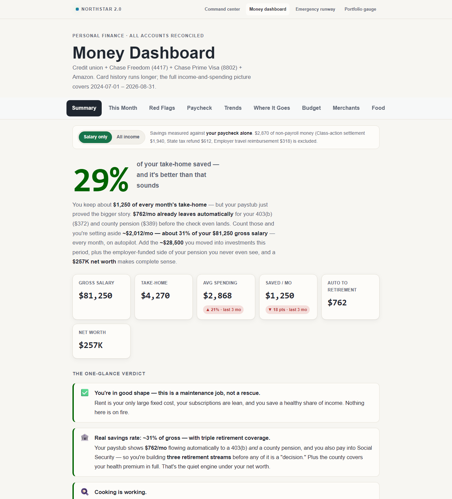
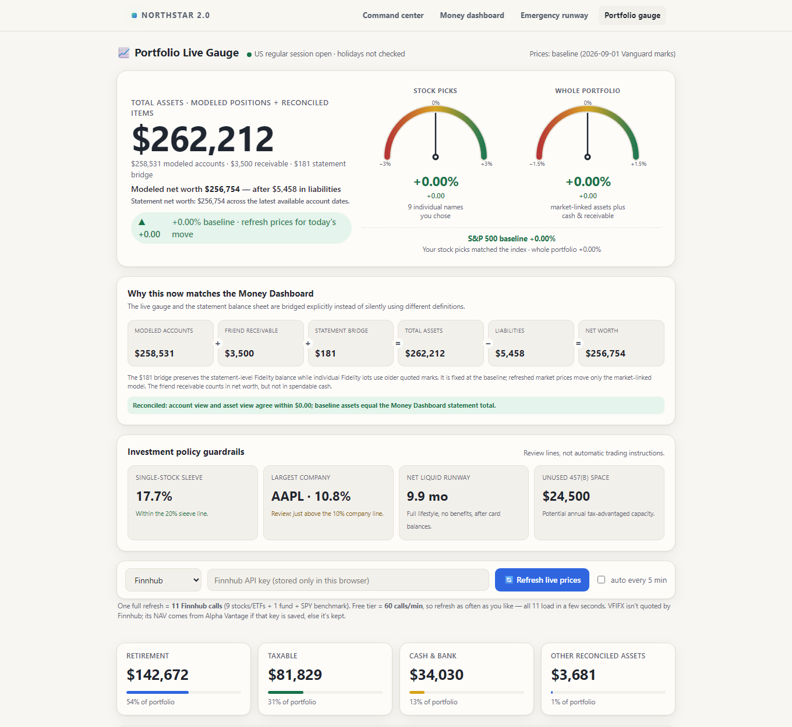
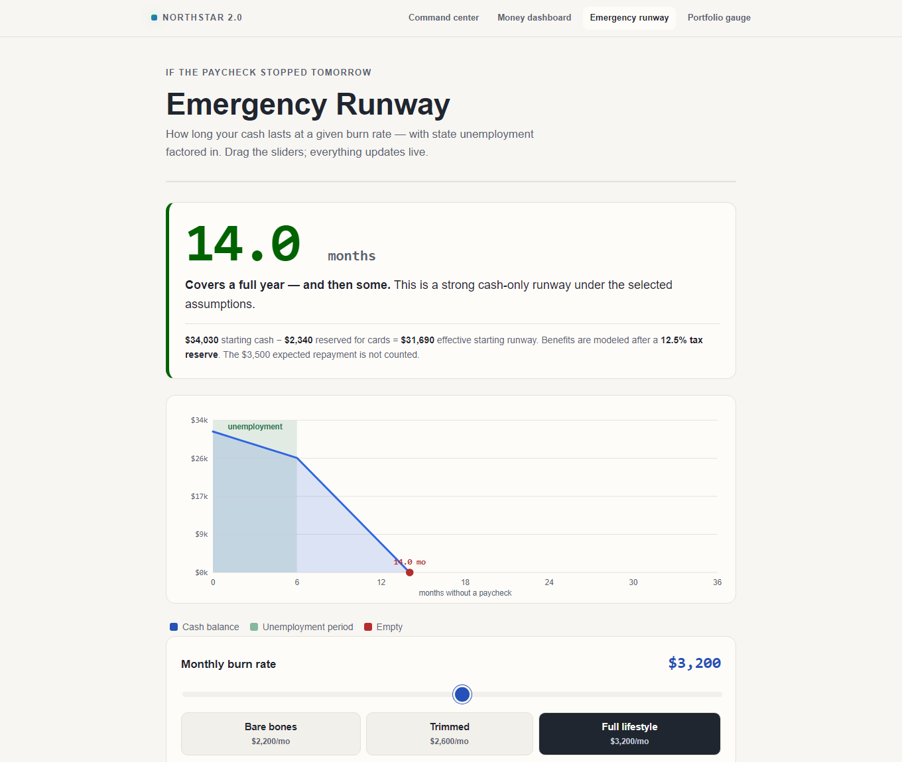

# Northstar — a personal-finance pipeline with four reconciled dashboards

Raw exports in — a credit union's transaction CSVs and statement PDFs, Chase card activity,
Amazon and Chewy order history, eleven years of Venmo statements, a brokerage positions file,
and the card issuer's transaction-alert emails — and four linked, self-contained HTML
dashboards out, rebuilt by one command and gated by twenty integrity checks.

**Live demo (sample data):** https://data-dl.github.io/northstar-finance/

Everything in this repository runs on a **synthetic household** produced by the included
generator. There is no real person behind the numbers: every balance, merchant, account number
and name in `data/` was invented, and the tests prove the generated files are closed over that
invented vocabulary. Point the same code at real exports and it is a working personal tool.

[](https://github.com/data-dl/northstar-finance/actions/workflows/tests.yml)

| Command center | Money dashboard |
|---|---|
|  |  |
| **Portfolio gauge** | **Emergency runway** |
|  |  |

## Run it

```bash
git clone https://github.com/data-dl/northstar-finance
cd northstar-finance
python -m pip install -e ".[dev]"
python update.py            # load → reconcile → compute → validate → render (≈2 s)
```

Then open `output/index.html`. To regenerate the sample from scratch, `python -m synth --out data`
(stdlib only, seeded, ~0.1 s); to rebuild the static demo in `docs/`, `python tools/build_demo.py`.

```
$ python update.py
✓ Loaded bank (2 csv + 0 pdf), cards (3), amazon (2), venmo (11), paystubs (config), balances (9 accounts), card bills (2 cards)
✓ Reconciled: 26-mo savings rate 31% · avg spend $2,868/mo · income verified
✓ Validation passed (20/20 checks)
    ✓ Gross paycheck x checks/year matches annual salary: 81250.00 vs 81250.00 (0.0% off)
    ✓ Category breakdown sums ~= total spend: 74556.56 vs 74556.37 (0.0% off)
    ✓ Internal transfers (checking<->savings) net to ~0: net 0.00 on 32500.00 moved (tolerance 3250.00)
    ✓ Paycheck components sum to gross (to the cent): net 1970.68 + deductions 1154.32 = 3125.00 vs gross 3125.00
    ✓ Net worth equals assets minus liabilities: 262212.08 - 5458.43 = 256753.65 vs 256753.65
    ✓ Vanguard position detail reconciles to account balances: largest account difference 0.00 across 4 accounts
    ...
✓ Rendered output/index.html, output/dashboard.html, output/runway.html, output/portfolio_gauge.html
Done in 1.3s
```

## What is in it

```
raw exports ──► finlib/loaders.py ──► finlib/reconcile.py ──► finlib/metrics.py ──► finlib/validate.py ──► finlib/render.py
 data/            one loader per        every bank debit         ~30 metric blocks     20 checks, most      data.js + the four
 (8 sources)      source, overlap-      into exactly one          (categories, habits,  of them fatal        templates
                  safe dedupe           bucket; accrual basis     merchants, runway…)
```

- **Reconciliation rules that make the numbers right** ([docs/DESIGN.md §5](docs/DESIGN.md)).
  Every bank debit lands in exactly one bucket — loan out, internal transfer, investing, family
  support, card payment, direct spend — and total spend is bank direct-spend plus card purchases,
  never card payments (the classic double count). Amazon, Chewy and Venmo statements are
  *itemization* of money the bank or a card already recorded; the Venmo lump is relabelled
  across the categories it funded, in each month's proportions, with the total conserved.
- **Overlap-safe loading.** Bank exports come year-at-a-time and card pulls are full-history, so
  files overlap. Dedupe is keyed *per occurrence* within each source file, so the overlap
  collapses while two genuinely identical same-day charges (two $2.75 transit taps) both survive.
- **Fail-loudly validation.** Paycheck arithmetic to the cent, category totals reconciling to
  spend, internal transfers netting to zero, and a chain of balance-sheet identities (tax
  buckets, allocation and account rows each summing to total assets; positions equal shares ×
  price; brokerage positions reconciling to account balances; the command center's integrity
  contract matching the source metrics). A missing statement is detected as a coverage gap and
  excluded from every average instead of masquerading as a cheap month.
- **Near-real-time card spending from alert emails** (`finlib/alerts.py`, `finlib/gmail_sync.py`).
  Read-only Gmail scope; token encrypted with Windows DPAPI outside the project; sender allow-list;
  subject/body amount cross-check; declines, reversals and fuel holds quarantined in a visible
  review lane rather than dropped; money as Decimal with integer cents alongside; dedupe on both
  the message id and the issuer's Notification-Id. Alerts are authorisations, so they stay in a
  pending lane and each card's own statement export supersedes them independently.
- **Analyses the tabs are built on:** the corner-store decoder reads card tickets back into
  baskets because they land on a $0.25 grid plus 7% tax; the same energy drink is priced across
  the corner store and Amazon bulk orders; recurring bills are detected with cadence, ended
  services and sustained price creep; a 30-day forward ledger of committed cash; an era analysis
  that separates a card pivot from the one-time costs that happened to land after it; per-paycheck
  savings that strip the 2-vs-3-payday calendar effect out of the monthly rate; and a red-flag
  audit generated from the data.
- **A synthetic household, generated end to end** (`synth/`). Not a scrubbed copy — the raw
  exports are produced from a persona (biweekly payroll, rent, seasonal utilities, a corner-store
  habit, a cooking pivot, a card pivot, a cat, a friend loan, roommate-era Venmo rent, a 2023 loan
  repaid off-platform) in the exact file formats the loaders parse, including the format quirks:
  a positive-only bank `Amount` with direction in `Type`, Venmo's header on row 3, Chewy's scraped
  column names, the brokerage export's two stacked tables. The dashboards' hand-written commentary
  is calibrated to this household and a test pins the figures it quotes.

## Tests

```bash
python -m pytest -q      # 45 tests, ~7 s
```

The alert parser against a captured (and sanitised) issuer email; the Gmail fetch layer with a
stubbed API; the generator's contract (same seed → same bytes, every expected file present,
tickets on the price grid, statement points reconciling); the full pipeline end to end over a
fresh sample (every integrity check passes, overlapping exports do not double count, card
payments and lending never count as spending, the Venmo relabel conserves money, alerts stay
pending, price creep and ended services are detected, `update.py` renders all four pages); and
a hygiene suite asserting that every card, counterparty, merchant and institution in the sample
comes from the persona vocabulary. CI runs the suite and a full `update.py` on every push.

## Layout

```
config.yaml        every household-specific value — nothing personal lives in code
update.py          entry point
finlib/            loaders · reconcile · metrics · validate · render · alerts · gmail_sync
templates/         the four pages (data-driven HTML; commentary calibrated to the sample)
synth/             persona.py (the invented household) · generate.py (writes data/)
data/              the generated raw exports the pipeline reads (MANIFEST.json summarises them)
tools/             serve.py (loopback server so the Update button works) · sync_alerts.py ·
                   build_demo.py (docs/) · Windows launchers
docs/              DESIGN.md · the static demo GitHub Pages serves · screenshots
tests/
ASSUMPTIONS.md     every invented default in the sample and where it came from
```

## Limits, stated plainly

- Statement PDFs (bank and card) are parsed when present, but the sample ships none: the
  bank history is CSV-only and card statement facts come from `data/cards/statements.json`.
- The third card has no export and alerts off, so its spending is invisible except for the
  balance in its monthly statement email — the dashboards say so rather than pretending.
- The Gmail sync and the DPAPI token store are Windows-specific and off by default; the build
  never touches the network.
- The narrative prose in the templates is authored, not generated. Numbers update on every run;
  sentences only when the story changes.

## Provenance

Built during the summer of 2026 as a personal tool, with an AI coding assistant as pair
programmer. The design, the reconciliation rules and every judgement about what the numbers
mean are mine; the same brief was also given to a second assistant as a side-by-side
comparison, and a few of the alert parser's guarantees were adopted from that build. MIT licensed.
